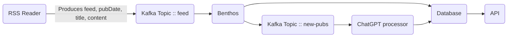

# techtheon

tiny change...

```mermaid
graph LR
    A(RSS Reader) -- "Produces feed, pubDate, title, content" --> B(Kafka Topic :: feed)
    F --> C(API)
    B --> D(Benthos)
    D --> F
    D --> G(Kafka Topic :: new-pubs)
    G --> E(ChatGPT processor)
    E --> F(Database)
```
